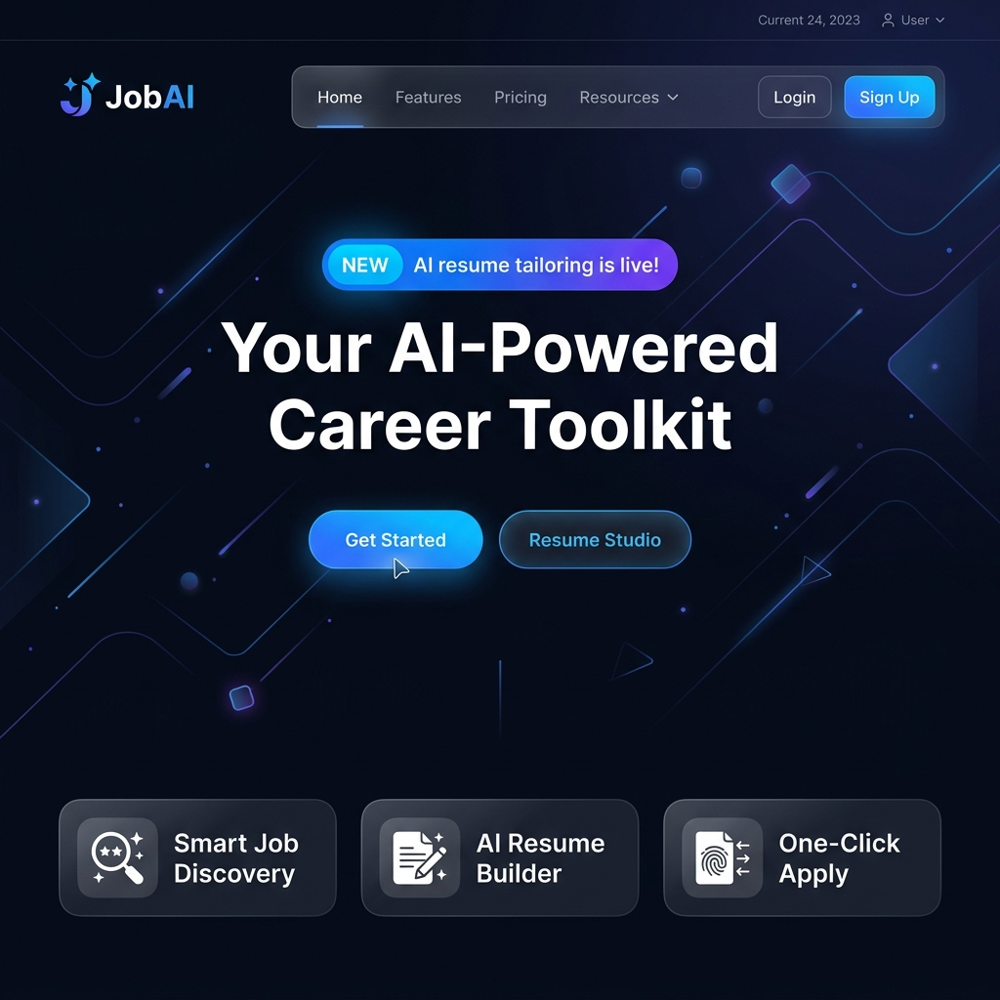
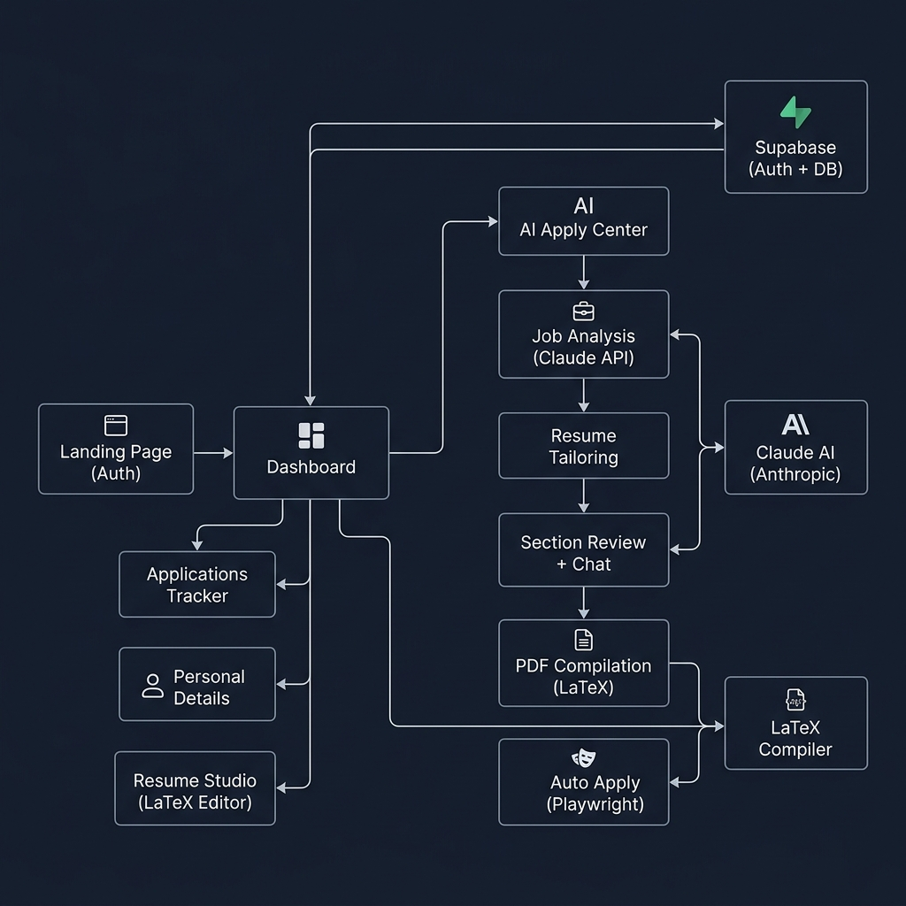
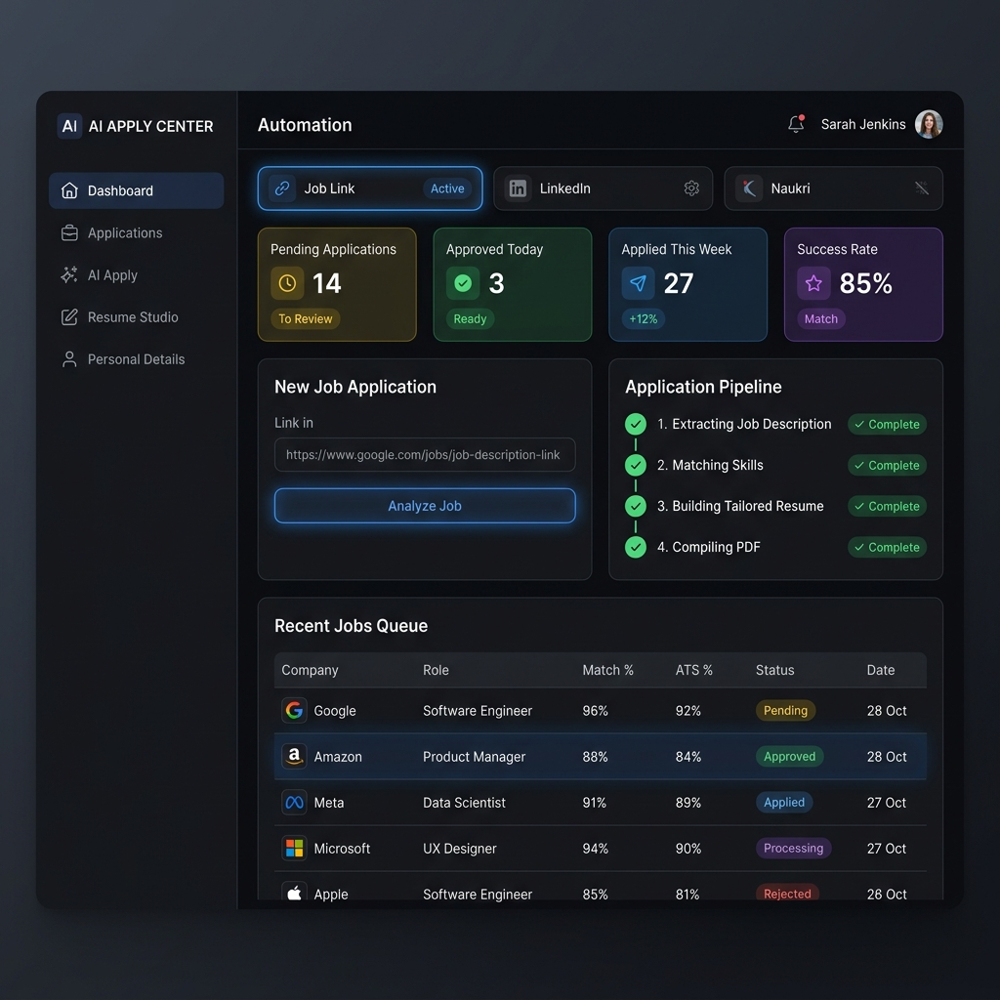
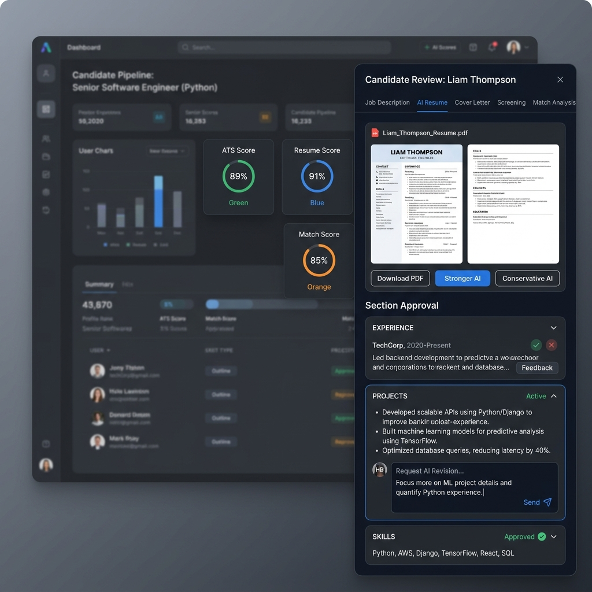
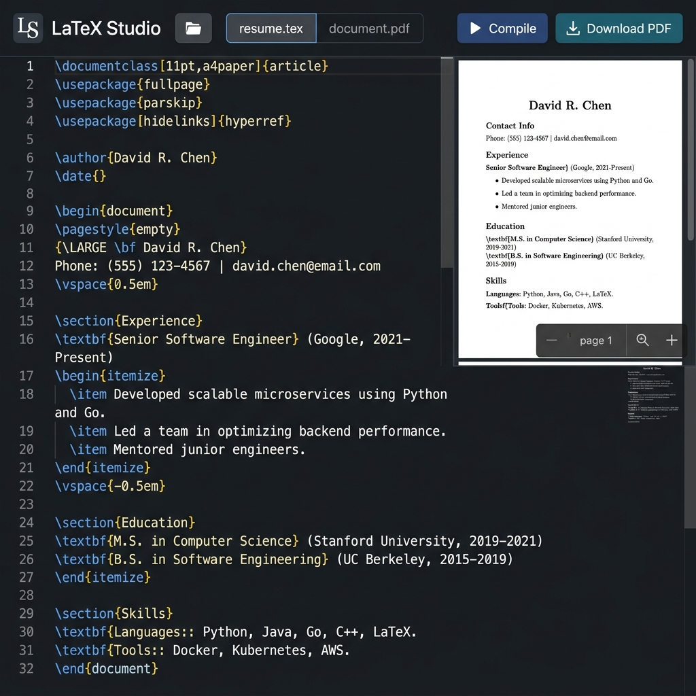

<p align="center">
  
</p>

<h1 align="center">🤖 Autonomous Job Application Agent</h1>

<p align="center">
  <strong>An AI-powered, end-to-end autonomous job application system that analyzes job descriptions, tailors resumes using LLMs, compiles LaTeX to PDF, and auto-applies — all from a single dashboard.</strong>
</p>

<p align="center">
  
  
  
  
  
  
</p>

---

## 📋 Table of Contents

- [Overview](#-overview)
- [Architecture](#-architecture)
- [Features](#-features)
- [Screenshots](#-screenshots)
- [Tech Stack](#-tech-stack)
- [Project Structure](#-project-structure)
- [Getting Started](#-getting-started)
- [Environment Variables](#-environment-variables)
- [Database Setup](#-database-setup)
- [API Endpoints](#-api-endpoints)
- [AI Pipeline Details](#-ai-pipeline-details)
- [License](#-license)

---

## 🧠 Overview

This project is a **fully autonomous job application agent** — a Next.js web application that automates the entire job application lifecycle:

1. **Paste a job URL or description** → AI extracts and analyzes the job requirements
2. **AI tailors your resume** → Selects relevant projects, optimizes experience bullets, reorders skills for ATS
3. **Section-by-section review** → Approve or request AI revisions via chat for Experience, Projects, and Skills
4. **LaTeX → PDF compilation** → Generates a professionally formatted, ATS-optimized single-page resume
5. **Auto-apply** → Uses Playwright browser automation to fill and submit job applications
6. **Track everything** → Full application history with status tracking in a persistent dashboard

The system uses **Claude AI (Anthropic)** for intelligent resume tailoring, **LaTeX** for pixel-perfect PDF generation, **Supabase** for authentication and data persistence, and **Playwright** for browser-based auto-application.

---

## 🏗 Architecture

<p align="center">
  
</p>

### High-Level Flow

```
User Input (Job URL/Text)
    │
    ▼
┌──────────────────┐    ┌──────────────────┐
│  Job Analyzer     │───▶│  Claude AI API    │
│  /api/ai/analyze  │    │  (Anthropic)      │
└──────────────────┘    └──────────────────┘
    │
    ▼
┌──────────────────┐    ┌──────────────────┐
│  Resume Tailor    │───▶│  Claude AI API    │
│  /api/ai/tailor   │    │  + Project Pool   │
└──────────────────┘    └──────────────────┘
    │
    ▼
┌──────────────────┐
│  Section Review   │◀──── User Approval / Chat Revision
│  (Experience,     │────▶ /api/ai/revise-section
│   Projects, Skills│
└──────────────────┘
    │
    ▼
┌──────────────────┐    ┌──────────────────┐
│  LaTeX Compiler   │───▶│  PDF Generation   │
│  /api/compile     │    │  (pdflatex)       │
└──────────────────┘    └──────────────────┘
    │
    ▼
┌──────────────────┐    ┌──────────────────┐
│  Auto Apply       │───▶│  Playwright       │
│  /api/auto-apply  │    │  (Browser Bot)    │
└──────────────────┘    └──────────────────┘
    │
    ▼
┌──────────────────┐
│  Supabase DB      │ ← Application tracked
│  (Applications)   │
└──────────────────┘
```

---

## ✨ Features

### 🎯 AI Apply Center
- **Single-link processing**: Paste any job URL (LinkedIn, Greenhouse, Lever, Workday, company careers pages)
- **Bulk processing**: Paste multiple job links at once
- **4-step pipeline**: Job extraction → Skill matching → Resume tailoring → PDF compilation
- **Real-time progress tracking** with animated pipeline visualization

### 🧠 Intelligent Resume Tailoring
- **3 tailoring modes**: Balanced, Stronger (aggressive ATS optimization), Conservative (minimal changes)
- **Smart project selection**: AI picks the 3 most relevant projects from a pool of 10+ projects
- **Experience optimization**: Rewrites bullet points with strong action verbs and JD-aligned keywords
- **Skills reordering**: Prioritizes skills categories based on job relevance
- **One-page guarantee**: Auto-shortens content if the resume overflows to multiple pages

### ✅ Section-by-Section Review
- **Expandable sections**: View AI-generated content for Experience, Projects, and Technical Skills
- **Approve or reject** each section independently
- **Chat-based revision**: When rejecting, type feedback and AI revises the section in real-time
- **Live PDF recompilation**: Changes are immediately reflected in the PDF preview

### 📝 Cover Letter Generation
- AI-generated cover letters tailored to each job description
- One-click copy and approve workflow

### 🔗 LinkedIn Automation
- Paste a LinkedIn job search URL
- Set max number of applications
- Real-time activity log showing applied/skipped jobs
- Auto-saves applications to the tracker

### 📄 LaTeX Resume Studio
- Full-featured LaTeX editor with Monaco Editor (VS Code engine)
- Syntax highlighting for LaTeX
- Live PDF preview with one-click compilation
- Keyboard shortcut (Ctrl+S) to compile
- Custom filename for downloaded PDFs
- Dark/light theme support

### 👤 Personal Details Management
- Comprehensive profile: Identity, Contact, Address, Education, Work Preferences, Legal
- Language proficiency tracking
- Technology experience with years of experience
- **Project pool management**: Add, edit, remove projects with bullets and LaTeX snippets
- **Base resume template**: Editable LaTeX template used as the starting point for AI tailoring
- Custom fields for application-specific questions

### 📊 Applications Dashboard
- Track all applied jobs with status (Applied, Interview, Offer, Rejected)
- Stats overview: Total, Interviews, Offers, Rejection rate
- Platform tracking (Job Link, LinkedIn, Naukri)
- Direct links to original job postings

### 🔐 Authentication & Security
- Supabase Auth with email/password
- Row Level Security (RLS) on all database tables
- Secure API key management via environment variables
- Middleware-based route protection

---

## 📸 Screenshots

### Landing Page & Authentication
<p align="center">
  
</p>
<p align="center"><em>Modern landing page with animated background paths, auth flow, and feature highlights</em></p>

### AI Apply Center
<p align="center">
  
</p>
<p align="center"><em>Paste job links, watch the 4-step AI pipeline process in real-time, manage job queue</em></p>

### Resume Review & Chat Revision
<p align="center">
  
</p>
<p align="center"><em>Section-by-section approval with ATS/Resume/Match scores, PDF preview, and chat-based AI revision</em></p>

### LaTeX Resume Studio
<p align="center">
  
</p>
<p align="center"><em>Full LaTeX editor with Monaco Engine, live PDF compilation, and download</em></p>

---

## 🛠 Tech Stack

| Layer | Technology | Purpose |
|-------|-----------|---------|
| **Framework** | Next.js 16 (App Router) | Full-stack React framework with API routes |
| **Language** | TypeScript | Type-safe development |
| **AI Engine** | Claude Sonnet 4 (Anthropic) | Job analysis, resume tailoring, section revision, cover letters |
| **Auth & DB** | Supabase | Email auth, PostgreSQL database, Row Level Security |
| **PDF Engine** | pdflatex (LaTeX) | Professional resume PDF compilation |
| **Automation** | Playwright | Browser automation for auto-applying |
| **Code Editor** | Monaco Editor | LaTeX editing with syntax highlighting |
| **Animations** | Framer Motion | Smooth page transitions and micro-interactions |
| **Icons** | Lucide React | Consistent iconography |
| **Styling** | CSS Modules | Scoped, maintainable styles |

---

## 📁 Project Structure

```
src/
├── app/
│   ├── page.tsx                          # Landing page with auth
│   ├── layout.tsx                        # Root layout
│   ├── globals.css                       # Global styles & theme variables
│   │
│   ├── api/
│   │   ├── ai/
│   │   │   ├── analyze-job/route.ts      # Job description analysis (Claude)
│   │   │   ├── tailor-resume/route.ts    # Resume tailoring engine (Claude)
│   │   │   ├── revise-section/route.ts   # Chat-based section revision (Claude)
│   │   │   └── generate-cover-letter/route.ts  # Cover letter generation
│   │   ├── compile/route.ts              # LaTeX → PDF compilation
│   │   ├── auto-apply/route.ts           # Playwright browser automation
│   │   ├── linkedin-apply/route.ts       # LinkedIn auto-apply streaming
│   │   ├── applications/route.ts         # CRUD for application tracking
│   │   └── personal-details/route.ts     # User profile management
│   │
│   ├── dashboard/
│   │   ├── layout.tsx                    # Dashboard shell with sidebar
│   │   ├── page.tsx                      # Dashboard home
│   │   ├── apply/
│   │   │   ├── page.tsx                  # AI Apply Center (main automation page)
│   │   │   ├── JobDrawer.tsx             # Resume review drawer with section approval
│   │   │   └── types.ts                  # TypeScript interfaces
│   │   ├── applications/page.tsx         # Application tracker
│   │   └── personal-details/page.tsx     # Profile & project management
│   │
│   ├── resume-studio/page.tsx            # LaTeX editor + PDF preview
│   └── auth/callback/route.ts            # Supabase auth callback
│
├── components/
│   └── ThemeToggle.tsx                   # Dark/light theme switcher
│
├── context/
│   └── ThemeContext.tsx                  # Theme context provider
│
├── data/
│   ├── base-resume.ts                   # Default LaTeX resume template
│   └── projects.ts                      # Project pool (10 projects with LaTeX)
│
├── lib/
│   ├── latex-parser.ts                  # LaTeX section extraction & replacement
│   └── supabase/
│       ├── client.ts                    # Browser Supabase client
│       └── server.ts                    # Server-side Supabase client
│
└── middleware.ts                        # Auth route protection

supabase/
└── schema.sql                           # Database schema with RLS policies
```

---

## 🚀 Getting Started

### Prerequisites

- **Node.js** 18+ and npm
- **LaTeX distribution** (TeX Live or MiKTeX) with `pdflatex` available in PATH
- **Supabase** account (free tier works)
- **Anthropic API key** for Claude AI

### Installation

```bash
# Clone the repository
git clone https://github.com/kevinsudhan/AUTOMOMOUS-JOB-APPLICATION-AGENT-.git
cd AUTOMOMOUS-JOB-APPLICATION-AGENT-

# Install dependencies
npm install

# Set up environment variables (see below)
cp .env.example .env.local

# Run development server
npm run dev
```

The app will be available at `http://localhost:3000`.

### Production Build

```bash
npm run build
npm start
```

---

## 🔑 Environment Variables

Create a `.env.local` file in the project root:

```env
# Supabase
NEXT_PUBLIC_SUPABASE_URL=https://your-project.supabase.co
NEXT_PUBLIC_SUPABASE_ANON_KEY=your-anon-key

# Anthropic (Claude AI)
CLAUDE_API_KEY=sk-ant-your-api-key

# Optional: for auto-apply features
PLAYWRIGHT_BROWSERS_PATH=0
```

---

## 🗄 Database Setup

Run the following SQL in your Supabase SQL Editor:

```sql
-- Personal details table (1 row per user)
CREATE TABLE IF NOT EXISTS personal_details (
  id UUID PRIMARY KEY DEFAULT gen_random_uuid(),
  user_id UUID REFERENCES auth.users(id) ON DELETE CASCADE NOT NULL UNIQUE,
  data JSONB NOT NULL DEFAULT '{}',
  profile_complete BOOLEAN DEFAULT FALSE,
  created_at TIMESTAMPTZ DEFAULT NOW(),
  updated_at TIMESTAMPTZ DEFAULT NOW()
);

-- Applications tracking table
CREATE TABLE IF NOT EXISTS applications (
  id UUID PRIMARY KEY DEFAULT gen_random_uuid(),
  user_id UUID REFERENCES auth.users(id) ON DELETE CASCADE NOT NULL,
  company TEXT,
  role TEXT,
  job_url TEXT,
  status TEXT DEFAULT 'applied',
  match_score INTEGER,
  ats_score INTEGER,
  platform TEXT DEFAULT 'job-link',
  applied_at TIMESTAMPTZ DEFAULT NOW(),
  notes TEXT,
  created_at TIMESTAMPTZ DEFAULT NOW()
);

-- Enable Row Level Security
ALTER TABLE personal_details ENABLE ROW LEVEL SECURITY;
ALTER TABLE applications ENABLE ROW LEVEL SECURITY;

-- RLS policies (users can only access their own data)
CREATE POLICY "Users can read their own details" ON personal_details FOR SELECT USING (auth.uid() = user_id);
CREATE POLICY "Users can insert their own details" ON personal_details FOR INSERT WITH CHECK (auth.uid() = user_id);
CREATE POLICY "Users can update their own details" ON personal_details FOR UPDATE USING (auth.uid() = user_id);

CREATE POLICY "Users can read their own applications" ON applications FOR SELECT USING (auth.uid() = user_id);
CREATE POLICY "Users can insert their own applications" ON applications FOR INSERT WITH CHECK (auth.uid() = user_id);
CREATE POLICY "Users can update their own applications" ON applications FOR UPDATE USING (auth.uid() = user_id);
CREATE POLICY "Users can delete their own applications" ON applications FOR DELETE USING (auth.uid() = user_id);
```

The full schema with triggers is available in [`supabase/schema.sql`](supabase/schema.sql).

---

## 🔌 API Endpoints

| Endpoint | Method | Description |
|----------|--------|-------------|
| `/api/ai/analyze-job` | POST | Analyzes a job description using Claude AI — extracts role, company, skills, responsibilities, match score |
| `/api/ai/tailor-resume` | POST | Tailors the base resume for a specific job — optimizes experience, selects projects, reorders skills |
| `/api/ai/revise-section` | POST | Revises a specific resume section based on user chat feedback |
| `/api/ai/generate-cover-letter` | POST | Generates a tailored cover letter for the job |
| `/api/compile` | POST | Compiles LaTeX source to PDF using pdflatex |
| `/api/auto-apply` | POST | Automates job application submission using Playwright |
| `/api/linkedin-apply` | POST | Streams LinkedIn auto-apply progress via SSE |
| `/api/applications` | GET/POST/PATCH/DELETE | CRUD operations for application tracking |
| `/api/personal-details` | GET/POST | User profile and project pool management |

---

## 🤖 AI Pipeline Details

### Job Analysis (`/api/ai/analyze-job`)
Extracts structured data from any job posting:
- Company name, role, location, salary
- Required and preferred skills
- Key responsibilities
- ATS keywords
- Match score against your profile
- Experience level classification

### Resume Tailoring (`/api/ai/tailor-resume`)
The core intelligence engine with strict rules:

**Experience Section:**
- Keeps same companies, roles, dates — only optimizes bullet wording
- Naturally incorporates ATS keywords from the JD
- Uses strong action verbs (Built, Engineered, Optimized, Scaled)
- Never invents fake work or metrics

**Projects Section:**
- Selects 3 most relevant projects from a pool of 10+
- Each bullet is **short, technical, and brief** — concise engineering language
- Fills in missing tech references from the JD where contextually appropriate
- Uses pre-authored LaTeX snippets as base content
- Never invents projects or fake tech stacks

**Skills Section:**
- Reorders categories based on JD relevance
- Moves most-wanted skills to the top
- Does not add skills the candidate doesn't have

### Section Revision (`/api/ai/revise-section`)
Chat-based revision loop:
- User rejects a section and types feedback
- AI revises the section LaTeX while preserving formatting
- Updated content is injected back into the full document
- PDF is recompiled automatically
- Supports multiple revision rounds per section

---

## 📄 License

This project is open source and available under the [MIT License](LICENSE).

---

<p align="center">
  Built with ❤️ by <a href="https://github.com/kevinsudhan">Kevin Sudhan</a>
</p>
